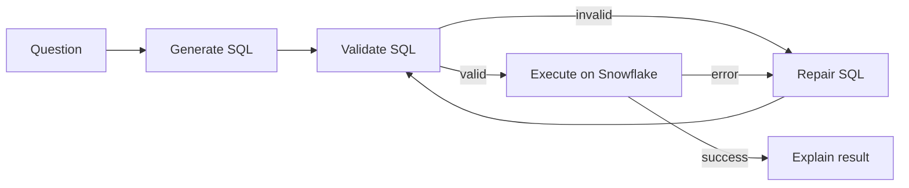

# Text-to-SQL Agent trên Snowflake

Scaffold Python 3.11 cho một agent chuyển câu hỏi tự nhiên thành Snowflake SQL. Dự án dùng
LangGraph để biểu diễn luồng generate → validate → execute → repair → explain và FastAPI làm
giao diện chính.

Hiện tại đây chủ ý là **skeleton**: `/health` chạy thật, `/ask` trả stub, graph chạy bằng các
placeholder xác định trước. Kết nối Snowflake, gọi LLM, SQL guard, sinh/nạp dữ liệu và evaluation
đều có interface cùng comment `TODO`, chưa có logic production.

## Quickstart

Yêu cầu Python 3.11.

```bash
python3.11 -m venv .venv
source .venv/bin/activate
python -m pip install -r requirements.txt
cp .env.example .env
uvicorn src.main:app --reload
```

Mở terminal khác để kiểm tra:

```bash
curl http://127.0.0.1:8000/health
# {"status":"ok"}
```

`/health` không cần credential. Trước khi tự triển khai `/ask`, hãy điền Snowflake và khóa của
provider đã chọn trong `.env`; không commit file này.

## API stub

```bash
curl -X POST http://127.0.0.1:8000/ask \
  -H 'Content-Type: application/json' \
  -d '{"question":"Tổng giao dịch theo chi nhánh?"}'
```

Response hiện có `status: "stub"` và chưa gọi Snowflake hay LLM.

## Kiến trúc



Chi tiết ranh giới module nằm ở [`docs/architecture.md`](docs/architecture.md).

## Lệnh tiện ích

```bash
make run       # chạy uvicorn
make test      # chạy pytest
make lint      # chạy ruff
make gen-data  # hiện là stub, chưa tạo CSV
```

Docker cũng có sẵn:

```bash
docker compose up --build
```

## TODO chính

1. Hiện thực `SQLGuard` bằng sqlglot: chỉ cho phép truy vấn đọc, chặn DML/DDL và `SELECT *`, ép
   giới hạn số dòng.
2. Hiện thực adapter OpenAI/Anthropic với temperature thấp và structured output.
3. Hiện thực Snowflake client, schema introspection, query timeout và query tagging.
4. Nối `/ask` vào graph, bổ sung dependency injection, tracing và error mapping.
5. Tạo star schema ngân hàng giả, loader và execution-accuracy evaluation.
