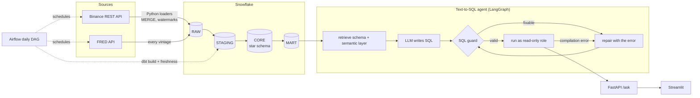

# FinSight AI

[](https://github.com/dt-thanh/TEXT-TO_SQL/actions/workflows/ci.yml)

Ask questions about crypto markets and the US macro backdrop in plain English or Vietnamese, and
get an answer computed in Snowflake, **together with the SQL that produced it**.

> *"What was Ethereum's annualized volatility in 2025 on days when the 10-year Treasury yield
> rose from the previous day?"* → SQL on curated marts → a number, a chart, the table, and the
> query, explained step by step.

The project has two halves that are built to production habits rather than demo shortcuts:

- **A data platform.** Binance (hourly candles for BTC, ETH, SOL, BNB since 2019) and FRED
  (Fed Funds rate, 10-year Treasury yield, with every revision) are loaded idempotently into
  Snowflake, modeled with dbt into point-in-time correct marts, and refreshed daily by Airflow.
- **A Text-to-SQL agent.** A LangGraph workflow writes SQL with an LLM, checks it with a
  sqlglot-based guard, runs it as a read-only Snowflake role, and repairs its own mistakes a
  bounded number of times. A FastAPI endpoint and a Streamlit screen serve it.

## Results

Measured on a benchmark of 21 hand-written questions with verified SQL, graded by comparing
**query results**, not SQL text (`make eval`, [eval/](eval/)). Model: `gpt-4o-mini`.

| Metric | Value |
|---|---|
| Execution accuracy, all questions | 18/21 (86%, 95% CI 65–95%) |
| Holdout questions (never used to tune anything) | 6/6 (95% CI 61–100%) |
| Generated SQL that passed the guard and ran | 18/18 |
| Latency per question, as the user waits | p50 2.4 s, p95 6.2 s |
| LLM cost per question | ~$0.0004 |
| Tests | 270+ Python tests, 70+ dbt data tests, CI on every push |

The benchmark is small and the confidence intervals say so. A single run also varies: the same
prompt passed one question 2 times out of 3. The numbers are reported with that uncertainty,
and prompt changes are compared with repeated A/B runs (see [Engineering notes](#engineering-notes)).

## Architecture



| Layer | What it does | Where |
|---|---|---|
| Ingestion | Idempotent MERGE loads, per-source watermarks, month-by-month backfill that survives crashes, retries with backoff | [src/ingestion/](src/ingestion/) |
| Warehouse | RAW → STAGING → CORE → MART with dbt; point-in-time macro join; known-answer and freshness tests | [dbt/](dbt/) |
| Orchestration | Airflow 3 in Docker; loads → freshness check → dbt layer by layer | [airflow/](airflow/) |
| Agent | LangGraph: retrieve context → generate → validate → execute → repair | [src/agents/](src/agents/) |
| Semantic layer | Metric definitions, glossary, verified example queries, all in YAML | [semantic/](semantic/) |
| Safety | AST-based SQL guard + least-privilege Snowflake role + timeouts | [src/services/sql_guard.py](src/services/sql_guard.py), [infra/snowflake/](infra/snowflake/) |
| Serving | FastAPI contract, Streamlit thin client (no secrets in the UI) | [src/api/](src/api/), [ui/](ui/) |
| Evaluation | Execution accuracy, dev/holdout split, Wilson intervals, latency and cost | [eval/](eval/) |

More detail: [docs/architecture.md](docs/architecture.md) (graph, error taxonomy, boundaries).

## Key design decisions

**Point-in-time macro data.** FRED revises its numbers. RAW keeps every published version
(vintage), and the mart joins each trading day only to the value that had already been
published that day, so an analysis of "days when yields rose" cannot use information from the
future. A dbt test checks it on known dates (Friday's 10-year yield is only known on Monday).

**The LLM is untrusted.** Its SQL is parsed into a syntax tree with sqlglot and must be exactly
one read-only query on allowlisted MART tables, with no `SELECT *` and a row cap. What runs is
the query printed back from the checked tree, without comments. Behind the guard, the agent's
Snowflake role can only `SELECT` from MART, and statements time out after 30 s.

**Repair only what can be repaired.** A compilation error (unknown column) or a fixable guard
violation goes back to the model with the failed SQL, at most twice. An attempt to write data,
a timeout or a lost connection ends the run: retrying those only costs money or teaches the
model to get around the guard.

**No silent wrong answers.** Results with two columns of the same name are refused (a dict would
drop one), a `LIMIT` without `ORDER BY` in the same SELECT is refused (it returns arbitrary
rows), and every answer states the newest day the data covers. Stale sources fail the Airflow
run instead of producing outdated answers.

**Semantic layer as reviewed data.** Formulas that no single column holds (volatility of a period,
compounded return, moving averages) live in YAML with English and Vietnamese synonyms and known
pitfalls, validated on load and checked against the warehouse by integration tests. Retrieval is
lexical on purpose: with a dozen concepts it is free, deterministic and easy to debug.

**No technology without a problem.** No vector database, no message queue, no Kubernetes: the
data volume and the number of concepts do not need them. Each tool in the stack answers a
specific need listed above.

## Engineering notes

A few things that were measured rather than assumed:

- **Latency.** A key-pair login to Snowflake costs ~2.3 s, and each question used to open two
  connections and re-read the schema: users waited 9–10 s. One kept connection per process and a
  10-minute schema cache brought the Snowflake part to ~0.1 s per question.
- **A prompt regression caught by A/B.** Adding three "harmless" rules to the system prompt
  dropped holdout accuracy from 26/27 to 20/27 over three runs each. An ablation isolated the
  cause, the rules were reverted, and the questions used to decide moved from holdout to dev.
- **Holdout discipline.** A question used to decide a change leaves the holdout split, so the
  holdout score stays an estimate for questions nobody tuned for.

## Tech stack

Python 3.11 · Snowflake · dbt 1.12 · Apache Airflow 3.3 · LangGraph · OpenAI (`gpt-4o-mini`,
Structured Outputs) · sqlglot · FastAPI · Streamlit · Docker Compose · pytest · GitHub Actions

## Getting started

Requirements: Python 3.11, a Snowflake account, a FRED API key, an OpenAI API key, and Docker for
Airflow and the containerised app.

```bash
python3.11 -m venv .venv && source .venv/bin/activate
make install                 # runtime + dev dependencies
cp .env.example .env         # then fill it in (see below)
make test-unit               # offline tests, no credentials needed
```

**Snowflake.** Create a key pair outside the repository (`~/.snowflake/`), run
[infra/snowflake/00_setup.sql](infra/snowflake/00_setup.sql) (warehouse, database, schemas, roles,
service user, resource monitor), [01_raw_tables.sql](infra/snowflake/01_raw_tables.sql) and
[02_agent_user.sql](infra/snowflake/02_agent_user.sql) (the read-only agent user), register the
public keys, and fill `SNOWFLAKE_*` in `.env`. `make check-snowflake` confirms the connection.

**Load and model the data.**

```bash
make load-binance    # first run backfills 2019 → now (~257k candles), later runs are incremental
make load-fred       # every FRED vintage since 2018-12
make dbt-deps && make dbt-build
```

**Ask questions.**

```bash
make ask Q="Which asset had the highest 30-day volatility on 2026-09-01?"
make run             # API on http://localhost:8000/docs
make ui              # in a second terminal: http://localhost:8501
```

## Commands

| Command | Purpose |
|---|---|
| `make ci` | Lint, unit tests and `dbt parse`: the checks CI runs, before you push |
| `make test` | All tests; integration tests run when Snowflake is configured |
| `make load-binance` / `make load-fred` | Incremental loads into RAW |
| `make dbt-build` / `make dbt-freshness` | Build and test the models / check source freshness |
| `make airflow-up` | Airflow in Docker, UI on :8081, daily run at 00:30 UTC |
| `make ask Q="..."` | One question from the terminal |
| `make prompt Q="..."` | Print exactly what the model would read, without calling it |
| `make eval` / `make eval ARGS="--split holdout"` | Benchmark (~$0.01 per full run) |
| `make run` / `make ui` / `make app-up` | API, UI, or both in Docker |

## Repository layout

```text
src/ingestion/   Binance and FRED clients, loaders, sync logic (watermarks, backfill)
dbt/             STAGING, CORE, MART models, seeds, data tests
airflow/         Airflow image, compose file and the daily DAG
src/agents/      LangGraph workflow, nodes, prompt building
src/semantic/    semantic layer loading and retrieval   (data in semantic/)
src/services/    Snowflake client, LLM client, SQL guard, chart selection
src/api/, ui/    FastAPI endpoints, Streamlit client
eval/            benchmark questions, grader, runner
tests/           unit (offline), integration (Snowflake, APIs), dags (needs Airflow)
infra/snowflake/ one-off SQL to create warehouse, roles and users
```

## Limitations and next steps

- The benchmark has 21 questions; a larger holdout set is the next priority for a trustworthy
  accuracy figure.
- Some multi-step questions still fail intermittently (forgetting a filter, per-day instead of
  per-period aggregation); the repair loop fixes compilation errors, not wrong reasoning.
- Single-turn questions only; follow-ups ("and for ETH?") would need conversation state.
- The API has no authentication yet, so it is meant to run locally; auth and rate limiting come
  before any deployment.

## Documentation

- [FINSIGHT_AI_PROJECT_SPEC.md](FINSIGHT_AI_PROJECT_SPEC.md): the full product and data specification.
- [docs/architecture.md](docs/architecture.md): agent graph, error taxonomy, module boundaries.
- [docs/README.vi.md](docs/README.vi.md): detailed setup and operations guide in Vietnamese.
