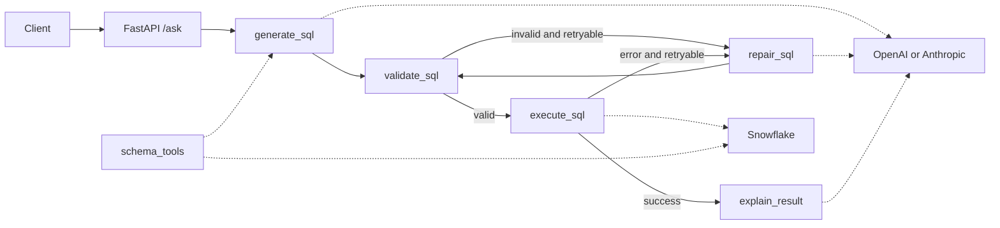

# Architecture skeleton

This project separates HTTP transport, LangGraph orchestration, safety policy, and external
adapters so each part can be implemented and tested independently.

## Boundaries

- `src/api` owns HTTP contracts and routing.
- `src/agents` owns state, nodes, edges, retry routing, and future checkpoints.
- `src/services` owns provider adapters and the SQL safety boundary.
- `data` and `eval` are offline tooling, not API runtime dependencies.

TODO: Document dependency injection, error taxonomy, security controls, and deployment topology.
