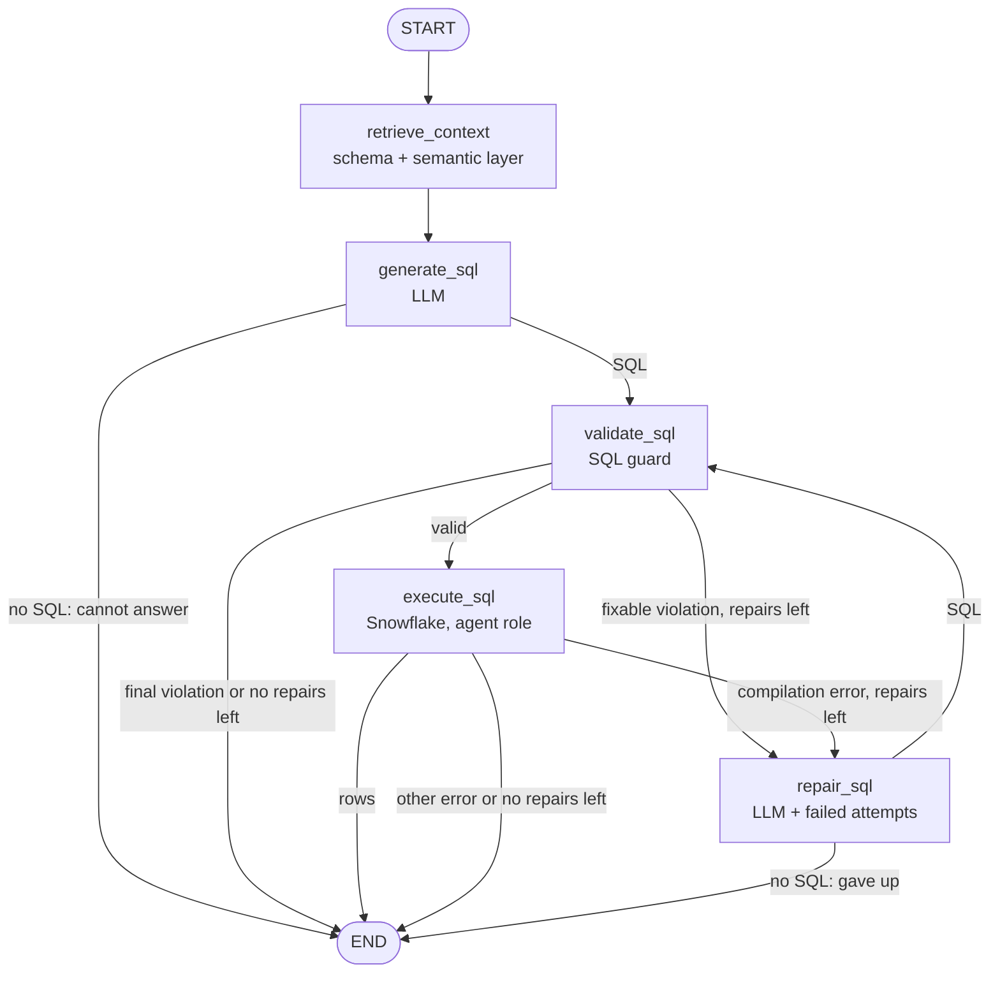

# Architecture

This project separates HTTP transport, LangGraph orchestration, safety policy, and external
adapters so each part can be implemented and tested independently.

## Text-to-SQL graph (src/agents/graph.py)

## Dependency injection

Nodes are plain functions `node(state, *, dependency)`. `build_graph(llm, warehouse, ...)` binds
the LLM client, the warehouse connection and the limits with `functools.partial`, so tests pass
fakes and no node reads a global client. `answer_question` builds the graph per call.

## Error taxonomy

| Where | Error | Repaired? | Why |
|---|---|---|---|
| SQL guard | `not_select`, `forbidden_statement`, `multiple_statements`, `forbidden_function` | no | an attempt to write or escape; retrying teaches the model to get around the guard |
| SQL guard | `select_star`, `unqualified_table`, `table_not_allowed`, `table_function`, `parse_error` | yes | a mistake in the SQL text |
| Snowflake | `SQL compilation error` (unknown column, syntax, types) | yes | a mistake in the SQL text |
| Snowflake | timeout, connection, privilege | no | rewriting the SQL does not change it |

At most `MAX_REPAIRS` (2) repairs per question; every failed attempt is kept and shown to the
next repair and to the analyst.

## Boundaries

- `ui` is a thin Streamlit client: it calls `POST /ask`, imports nothing from `src`, holds no secret.
- `src/api` owns HTTP contracts and routing; `src/models/schemas.py` is the contract.
- `src/agents` owns state, nodes, edges, retry routing, and prompt building (`sql_generation.py`).
- `src/semantic` reads the semantic layer (`semantic/*.yml`) and picks context per question.
- `src/services` owns provider adapters and the SQL safety boundary.
- `eval` is offline tooling, not an API runtime dependency.
